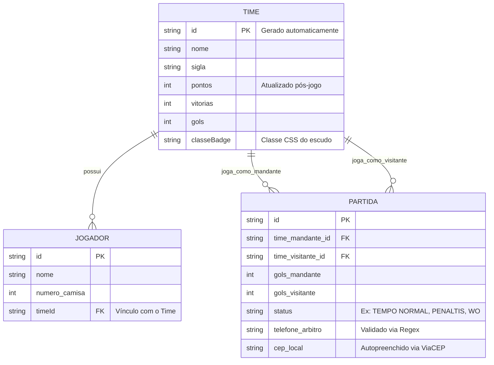

# 🛠️ Especificação Técnica (Tech Spec) - Sistema de Gestão AEC Futebol 7

Este documento detalha a arquitetura técnica, o modelo de dados e os contratos de API (via JSON Server) necessários para o funcionamento do painel administrativo do 1º Campeonato de Futebol 7 da AEC.

## 1. Modelo de Dados (Diagrama ER)

Abaixo está o Diagrama Entidade-Relacionamento (DER) que representa a estrutura do nosso "banco de dados" (`db.json`) e como as informações se conectam.



## 2. Dicionário de Dados

Breve explicação das tabelas principais:

- **Times (Classificação):** Responsável por armazenar os 16 times pré-cadastrados no sistema e suas pontuações acumuladas para a renderização da tabela na página inicial.
  - `id`: Identificador único numérico (String).
  - `pontos`, `vitorias`, `gols`: Valores inteiros que determinam a posição da equipe na tabela.
- **Partidas (Súmulas):** Registra o histórico de jogos submetidos pelos mesários através do formulário de registro.
  - `time_mandante_id` / `time_visitante_id`: Chaves estrangeiras que vinculam o resultado aos times registrados.
  - `status`: Define como a partida terminou. A interface captura isso obrigatoriamente através de Radio Buttons.
  - `telefone_arbitro`: Campo texto obrigatoriamente validado no Front-End por Expressão Regular (Regex) antes de chegar ao banco.
  - `cep_local`: Gatilho para o consumo assíncrono da API ViaCEP.

## 3. Rotas da API (JSON Server)

A aplicação consome a API local simulada pelo JSON Server na porta 3000. Abaixo os principais endpoints:

- `GET /times` - Retorna a lista de times e suas pontuações para exibição dinâmica no Dashboard.
- `GET /jogadores?timeId=1` - Retorna a lista de atletas cadastrados em um time específico.
- `POST /partidas` - Cadastra uma nova súmula (resultado) no histórico do campeonato.

## 4. Estrutura do Banco de Dados (db.json)

Esta é a representação em formato JSON do banco de dados simulado. Esta estrutura serve de contexto para o JSON Server inicializar a API Fake e persistir os resultados.

```json
{
  "times": [
    {
      "id": "1",
      "nome": "AEC Master",
      "sigla": "AEC",
      "pontos": 12,
      "vitorias": 4,
      "gols": 18,
      "classeBadge": "team-badge-aec"
    },
    {
      "id": "2",
      "nome": "Tijuca Rovers",
      "sigla": "TJR",
      "pontos": 10,
      "vitorias": 3,
      "gols": 14,
      "classeBadge": "team-badge-tjr"
    }
  ],
  "jogadores": [
    {
      "id": "1",
      "timeId": "1",
      "nome": "Carlos Silva",
      "numero_camisa": 10
    }
  ],
  "partidas": [
    {
      "id": "1",
      "time_mandante_id": "1",
      "time_visitante_id": "2",
      "gols_mandante": 3,
      "gols_visitante": 1,
      "status": "TEMPO NORMAL",
      "telefone_arbitro": "(42) 98888-7777",
      "cep_local": "85140-000"
    }
  ]
}
```

## 5. Stack Tecnológico e Controle de Versões

Para garantir a compatibilidade e orientar o uso de assistentes de IA (Copilot, Cursor) durante o desenvolvimento, o projeto adota as seguintes versões fixadas:

- **Framework CSS:** Bootstrap v5.3.3 (via CDN)
- **API Pública de Clima:** Open-Meteo API v1 (Endpoint: `/v1/forecast`)
- **API Pública de Endereçamento:** ViaCEP API v1 (Endpoint: `/ws/{cep}/json/`)
- **Manipulação DOM:** jQuery v3.7.1 (via CDN)
- **Máscaras de Input:** jQuery Mask Plugin v1.14.16 (via CDNcdnjs)
- **API Fake / Banco de Dados Local:** JSON Server (Instalado via NPM localmente)
